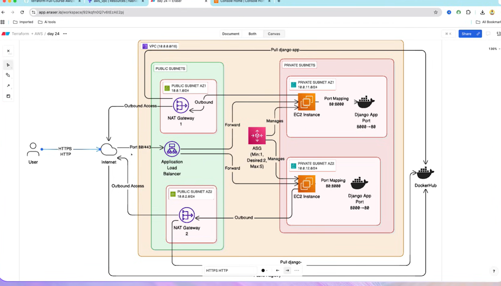

# High Available/Scalable Infrastructure Deployment 

## 📋 Project Overview

Production-grade, highly available Django application deployed on AWS using Terraform. Infrastructure spans multiple Availability Zones with automatic scaling.

### 🎯 Key Features

- **High Availability**: Multi-AZ deployment, no single point of failure
- **Auto Scaling**: Dynamic scaling (1-5 instances) based on CPU
- **Security**: Private instances with ALB-only access
- **Load Balancing**: Application Load Balancer distributes traffic
- **Containerized**: Django app running in Docker
- **Infrastructure as Code**: Fully automated with Terraform

## 🏗️ Architecture


```
Internet → ALB (Public) → EC2 Instances (Private) → NAT Gateways → Internet
                                ↓
                          Django Docker App
```

## image




### Components

- **VPC**: `10.0.0.0/16` across 2 AZs (us-east-1a, us-east-1b)
- **Public Subnets**: `10.0.1.0/24`, `10.0.2.0/24`
- **Private Subnets**: `10.0.11.0/24`, `10.0.12.0/24`
- **NAT Gateways**: 2 (one per AZ for HA)
- **ALB**: Internet-facing, spans both public subnets
- **ASG**: Min:1, Desired:2, Max:5 instances
- **Container**: `itsbaivab/django-app` (Port 8000→80)

## 📁 Code Structure

```
code/
├── main.tf              # Provider & Terraform configuration
├── variables.tf         # Input variables
├── outputs.tf           # Output values (ALB DNS, NAT IPs, etc.)
├── vpc.tf              # VPC, Subnets, NAT Gateways, Route Tables
├── security_groups.tf   # Security group definitions
├── alb.tf              # Load Balancer, Target Group, Listener
├── asg.tf              # Launch Template, ASG, Scaling Policies
├── s3.tf               # S3 bucket (optional)
└── scripts/
    └── user_data.sh     # EC2 initialization script
```

## 🚀 Quick Start

### Prerequisites

- AWS Account with appropriate permissions
- Terraform installed (v1.0+)
- AWS CLI configured

### Deploy

```bash
cd code/
terraform init
terraform plan
terraform apply -auto-approve
```

Deployment takes ~5-8 minutes.

### Access Application

```bash
terraform output load_balancer_dns
# Visit the DNS in your browser
```

### Cleanup

```bash
terraform destroy -auto-approve
```

---

